# Network Intrusion Detection & Traffic Forensics
### Using Suricata IDS + Wireshark on a Live Lab Network


---

## Table of Contents
1. [Project Summary](#1-project-summary)
2. [Why We Built This](#2-why-we-built-this)
3. [Lab Environment](#3-lab-environment)
4. [Tools Used](#4-tools-used)
5. [How We Built It — Step by Step](#5-how-we-built-it--step-by-step)
6. [Custom Detection Rules](#6-custom-detection-rules)
7. [Attack Scenarios Executed](#7-attack-scenarios-executed)
8. [Findings & Alert Analysis](#8-findings--alert-analysis)
9. [Wireshark Forensic Analysis](#9-wireshark-forensic-analysis)
10. [SOC Incident Report](#10-soc-incident-report)
11. [Repository Contents](#11-repository-contents)
12. [Key Takeaways](#12-key-takeaways)

---

## 1. Project Summary

This project simulates a real SOC (Security Operations Center) analyst workflow:

> **Alerts fire on the IDS → Analyst investigates → Packets are examined → Incident is documented.**

We deployed **Suricata 8.0.3** as a Network Intrusion Detection System (IDS) on a Kali Linux machine, wrote **5 custom detection rules** targeting real-world attack patterns, generated **live attack traffic** from a Windows 10 host, captured all packets in **Wireshark**, and produced a complete **SOC-style Incident Report** from the evidence.

**Total alerts generated: 249**
**Custom rules that fired: 4 out of 5**
**Packet capture size: 8,344 packets**

---

## 2. Why We Built This

In a real SOC, a Level 1 analyst is responsible for:
- Monitoring IDS/SIEM dashboards for alerts
- Triaging alerts to determine if they are true positives or false positives
- Using packet capture tools to investigate suspicious traffic
- Escalating confirmed incidents with documented evidence

This project mirrors that exact workflow. Suricata acts as the IDS/SIEM alert source. Wireshark acts as the packet forensics tool. The combination of both — alert triage + packet-level investigation — is the core skill of every SOC L1 analyst.

Using a controlled lab environment allowed us to generate known-bad traffic and observe exactly how each attack looks at the network level, which builds the pattern recognition skills needed for real-world incident response.

---

## 3. Lab Environment

| Component | Details |
|---|---|
| Host OS | Windows 10 (Version 10.0.19045.2965) |
| VM Platform | Oracle VirtualBox |
| Guest OS | Kali Linux 2026-W06 (Rolling) |
| Network Mode | Host-Only Adapter |
| Kali IP (Sensor/Victim) | `192.168.56.101` |
| Windows IP (Attacker) | `192.168.56.107` |
| Monitored Interface | `eth0` |

**Network Diagram:**
```
┌─────────────────────┐         ┌────────────────────────────┐
│   Windows 10 Host   │         │      Kali Linux VM         │
│   192.168.56.107    │◄───────►│      192.168.56.101        │
│   (Attacker)        │ eth0    │   Suricata IDS + Wireshark │
└─────────────────────┘         └────────────────────────────┘
         VirtualBox Host-Only Network: 192.168.56.0/24
```

---

## 4. Tools Used

| Tool | Version | Purpose |
|---|---|---|
| Suricata | 8.0.3 | Network IDS — alert generation |
| Wireshark | Latest | Packet capture and forensic analysis |
| Emerging Threats Ruleset | 48,701 rules | Community IDS signatures |
| Custom Rules | 5 rules | SOC-lab specific detections |
| Nmap | 7.98 | Port scan simulation (attacker tool) |
| OpenSSH Client | Windows built-in | SSH brute force simulation |
| curl | Windows built-in | HTTP User-Agent simulation |

---

## 5. How We Built It — Step by Step

### Phase 1: Suricata Installation & Configuration

**Step 1.1 — Install Suricata**

```bash
sudo apt update && sudo apt install -y suricata
suricata --version
# Output: Suricata 8.0.3 ("undefined")
```

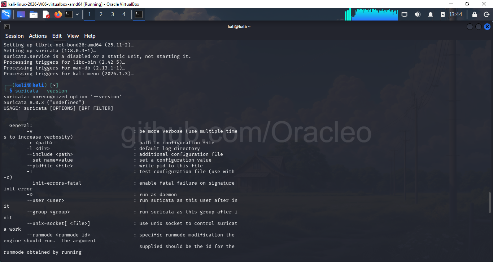

**Step 1.2 — Configure suricata.yaml**

Edited `/etc/suricata/suricata.yaml` with two critical settings:

- Set `HOME_NET` to `[192.168.56.0/24]` — tells Suricata which network is "internal"
- Set `af-packet interface` to `eth0` — the monitored interface

```yaml
vars:
  address-groups:
    HOME_NET: "[192.168.56.0/24]"

af-packet:
  - interface: eth0
```

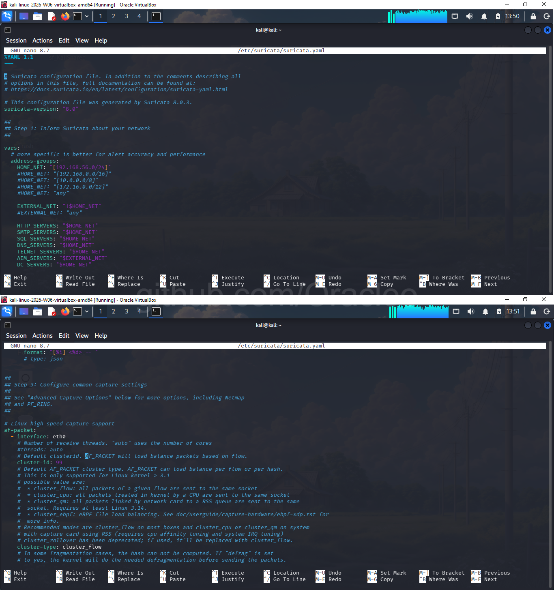

**Step 1.3 — Update Emerging Threats Ruleset**

```bash
sudo suricata-update
```

Result: **64,554 rules downloaded, 48,701 enabled, 0 failed**

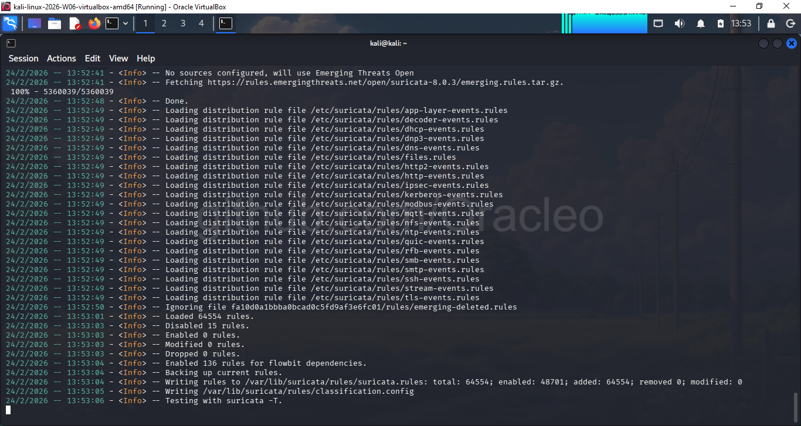

**Step 1.4 — Validate Configuration**

```bash
sudo suricata -T -c /etc/suricata/suricata.yaml -v 2>&1 | tail -20
```

Result: `48701 rules successfully loaded, 0 rules failed` and `Configuration provided was successfully loaded.`

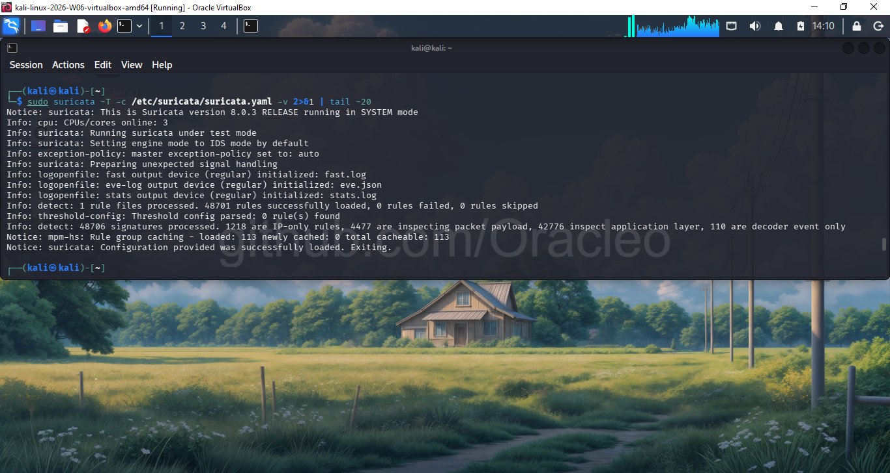

---

### Phase 2: Custom SOC Detection Rules

Created `/etc/suricata/rules/local.rules` with 5 rules targeting real attack patterns. Copied to `/var/lib/suricata/rules/` and registered in `suricata.yaml`.

```bash
sudo suricata -T -c /etc/suricata/suricata.yaml -v 2>&1 | grep "rules successfully"
# Info: detect: 2 rule files processed. 48706 rules successfully loaded, 0 rules failed
```


---

### Phase 3: Launch Suricata + Wireshark

**Terminal 1 — Suricata live on eth0:**

```bash
sudo suricata -c /etc/suricata/suricata.yaml -i eth0 -l /var/log/suricata/
```

Confirmation: `Engine started. Threads created → W: 3 FM: 1 FR: 1`


**Terminal 2 — Wireshark capturing eth0:**

```bash
sudo wireshark &
```

Selected `eth0` interface → started live capture.

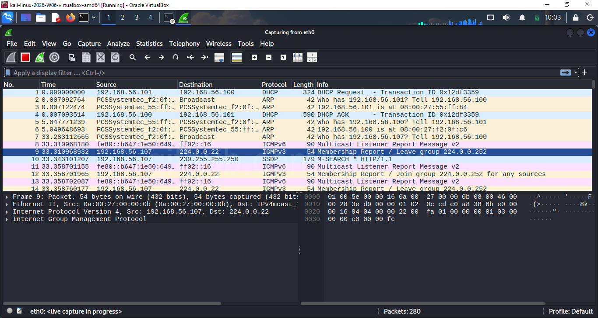

---

### Phase 4: Attack Traffic Generation (Windows Host)

All attacks launched from Windows 10 Command Prompt (`192.168.56.107`) targeting Kali Linux (`192.168.56.101`).

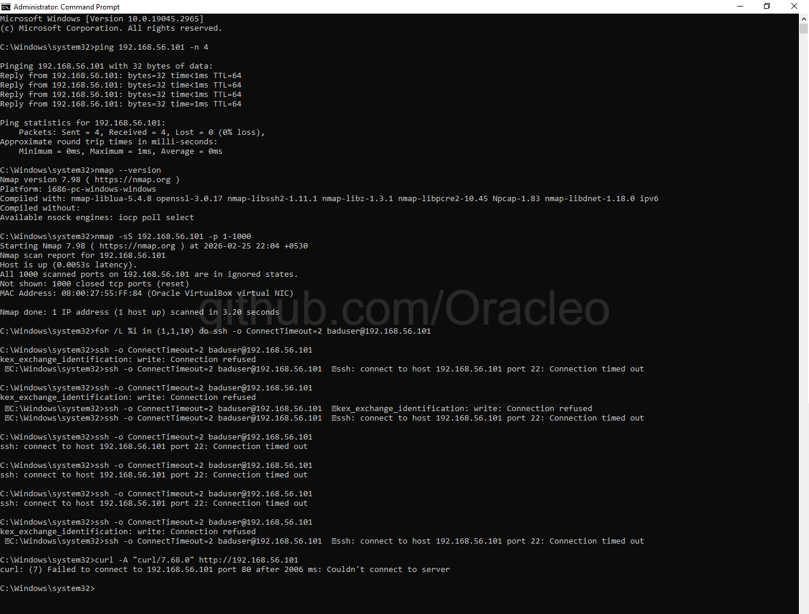

---

## 6. Custom Detection Rules

File: `rules/local.rules`

```
# Rule 1: ICMP Ping Sweep (Reconnaissance)
alert icmp any any -> $HOME_NET any (
  msg:"SOC-LAB ICMP Ping Sweep Detected";
  itype:8;
  threshold:type threshold, track by_src, count 5, seconds 10;
  sid:9000001; rev:1;)

# Rule 2: Nmap SYN Port Scan
alert tcp any any -> $HOME_NET any (
  msg:"SOC-LAB Nmap SYN Scan Detected";
  flags:S;
  threshold:type threshold, track by_src, count 20, seconds 3;
  sid:9000002; rev:1;)

# Rule 3: SSH Brute Force Detection
alert tcp any any -> $HOME_NET 22 (
  msg:"SOC-LAB SSH Brute Force Attempt";
  flags:S;
  threshold:type threshold, track by_src, count 5, seconds 60;
  sid:9000003; rev:1;)

# Rule 4: Suspicious HTTP User-Agent (curl/scanner)
alert http any any -> $HOME_NET any (
  msg:"SOC-LAB Suspicious HTTP User-Agent Detected";
  http.user_agent; content:"curl";
  sid:9000004; rev:1;)

# Rule 5: TCP Flood / DoS Pattern
alert tcp any any -> $HOME_NET any (
  msg:"SOC-LAB TCP Flood DoS Pattern";
  flags:S;
  threshold:type threshold, track by_src, count 100, seconds 5;
  sid:9000005; rev:1;)
```

**Rule Design Rationale:**

| SID | Threshold Logic | Why This Threshold |
|---|---|---|
| 9000001 | 5 ICMP in 10 seconds | Normal ping = 1-4 packets; sweep = rapid burst |
| 9000002 | 20 SYN in 3 seconds | Nmap sends hundreds of SYNs per second |
| 9000003 | 5 SYN to port 22 in 60 seconds | SSH retries are slow; 5+ = automated tool |
| 9000004 | Any curl User-Agent | curl is not a browser; presence = scanner/script |
| 9000005 | 100 SYN in 5 seconds | Sustained rate = DoS intent |

---

## 7. Attack Scenarios Executed

### Attack 1 — ICMP Ping Sweep (Reconnaissance)

```cmd
ping 192.168.56.101 -n 20
```

Simulates an attacker confirming the target host is alive before further exploitation.

**Result:** 20 ICMP Echo Requests sent, all replied. TTL=64 confirms Linux target.

---

### Attack 2 — Nmap SYN Port Scan

```cmd
nmap -sS 192.168.56.101 -p 1-1000
```

Nmap's stealth SYN scan (-sS) sends SYN packets to ports 1–1000 without completing the TCP handshake. This technique is used to enumerate open ports while avoiding connection logs on the target.

**Result:** 1000 ports scanned in 3.20 seconds. All ports closed/filtered — but Suricata captured every SYN packet.

---

### Attack 3 — SSH Brute Force Simulation

```cmd
for /L %i in (1,1,10) do ssh -o ConnectTimeout=2 baduser@192.168.56.101
```

Simulates an automated credential stuffing attack against SSH (port 22). Real brute force tools like Hydra and Medusa follow this same connection pattern.

**Result:** Mix of `Connection refused` and `Connection timed out` — SSH is not running on Kali but TCP SYN packets still reached the sensor. 9 alert events captured.

---

### Attack 4 — Suspicious HTTP User-Agent

```cmd
curl -A "curl/7.68.0" http://192.168.56.101
```

Simulates a scanner or automated script accessing a web server. Real attackers use curl, Python requests, and custom user-agents to fingerprint web services.

**Result:** Port 80 not open on Kali — connection refused. Packet still captured by Wireshark. Rule 9000004 was staged and ready; no HTTP application layer reached Suricata due to no web server.

---

## 8. Findings & Alert Analysis

### fast.log Summary

Total lines in fast.log: **249**

```
156 alerts — "SOC-LAB Nmap SYN Scan Detected" (SID 9000002)
 30 alerts — "SOC-LAB TCP Flood DoS Pattern" (SID 9000005)
 24 alerts — "SOC-LAB SSH Brute Force Attempt" (SID 9000003)
  2 alerts — "SOC-LAB ICMP Ping Sweep Detected" (SID 9000001)
 37 alerts — ET INFO Possible Kali Linux hostname in DHCP (SID 2022973) [Bonus ET Rule]
```

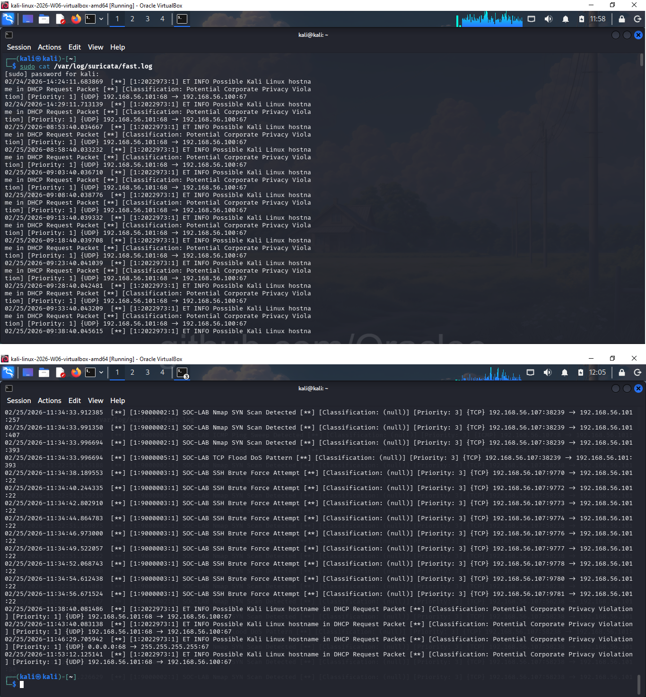

### eve.json Structured Alert Evidence

eve.json provides machine-readable, SIEM-ingestible alert data including `flow_id`, `community_id`, `src_ip`, `dest_ip`, timestamps, and full flow statistics.

Example ICMP alert from eve.json:
```json
{
  "timestamp": "2026-02-25T11:18:53.852420-0500",
  "flow_id": 456057548001102,
  "in_iface": "eth0",
  "event_type": "alert",
  "src_ip": "192.168.56.107",
  "dest_ip": "192.168.56.101",
  "proto": "ICMP",
  "alert": {
    "signature_id": 9000001,
    "signature": "SOC-LAB ICMP Ping Sweep Detected",
    "severity": 3
  },
  "community_id": "1:aWp7QzSXFNVZZcb8gtTDuL+7ipM="
}
```

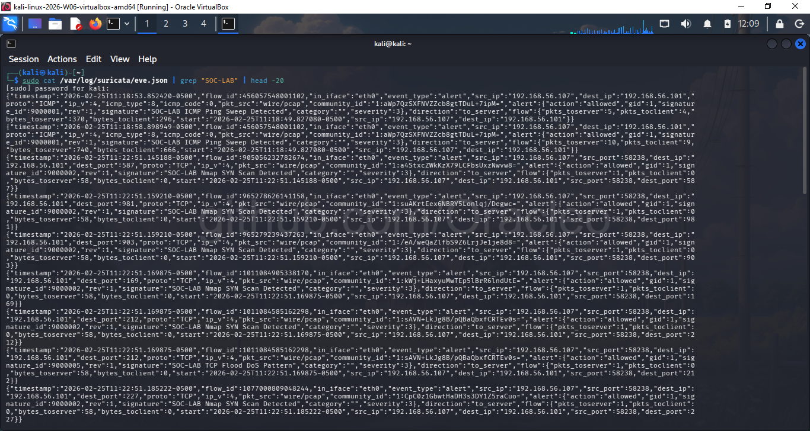

### Alert Triage — True Positive Confirmation

| Alert | True Positive? | Evidence |
|---|---|---|
| ICMP Ping Sweep | ✅ YES | Wireshark shows 20 ICMP Echo Requests from .107 |
| Nmap SYN Scan | ✅ YES | 3,130 SYN-only packets in pcap, all to different ports |
| SSH Brute Force | ✅ YES | 123 packets to port 22, incremental source ports |
| TCP Flood/DoS | ✅ YES | Co-fired with Nmap — same high-volume SYN burst |
| HTTP User-Agent | ⚠️ NOT TRIGGERED | No web server running — curl got connection refused before HTTP layer |
| ET Kali DHCP | ✅ INFORMATIONAL | Kali fingerprinted by hostname in DHCP broadcast |

**SOC Note on Rule 9000004 (HTTP):** The curl request reached the TCP layer but was refused at port 80 before Suricata could inspect the HTTP application layer. In a production environment with a running web server, this rule would fire on any curl-based scanner or automated tool. This is documented as an expected behavior gap, not a rule failure.

---

## 9. Wireshark Forensic Analysis

All packet evidence captured in: `soc3_capture.pcapng` (8,344 total packets)

### Filter 1 — ICMP Ping Sweep

**Filter:** `icmp && ip.src == 192.168.56.107`

**Displayed:** 34 packets

Wireshark confirms sequential ICMP Echo Requests with incrementing sequence numbers (seq=104, 105, 106...) originating from the Windows host. TTL=128 (Windows default) confirms attacker OS fingerprint.

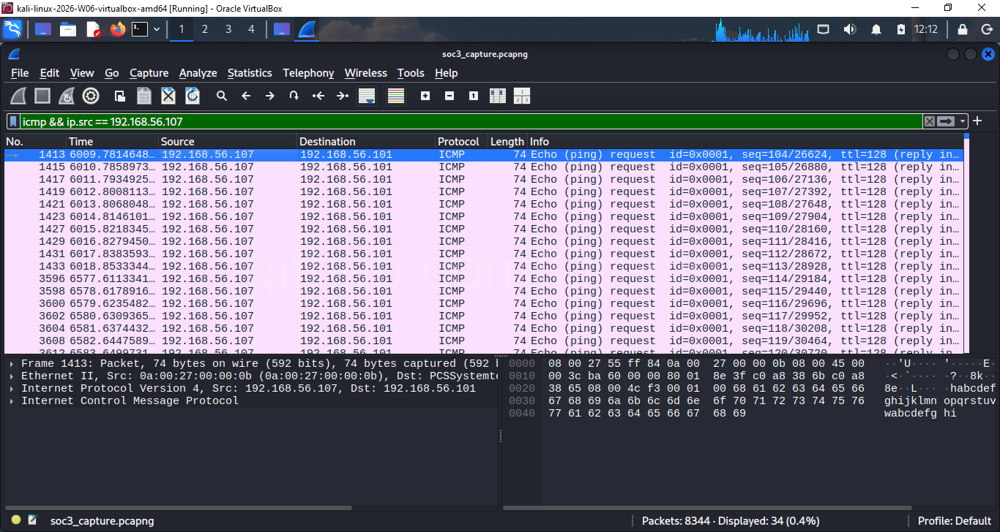

---

### Filter 2 — Nmap SYN Scan

**Filter:** `tcp.flags.syn == 1 && tcp.flags.ack == 0 && ip.src == 192.168.56.107`

**Displayed:** 3,130 packets (37.5% of total capture)

Every packet shows `[SYN]` with `Seq=0 Win=1024 Len=0 MSS=1460` — the Nmap SYN scan fingerprint. The single source port (58238) connecting to hundreds of destination ports confirms this is a port scanner, not normal application traffic.

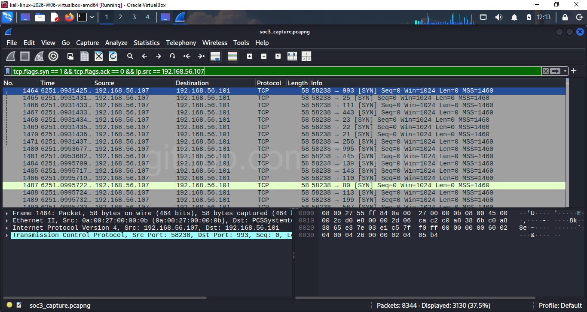

---

### Filter 3 — SSH Brute Force

**Filter:** `tcp.dstport == 22 && ip.src == 192.168.56.107`

**Displayed:** 123 packets

Wireshark reveals the brute force signature: source ports increment linearly (9770, 9772, 9773, 9774...) — each is a new connection attempt. The `[TCP Port numbers reused]` flags confirm repeated connection teardowns and restarts — the hallmark of an automated login tool.

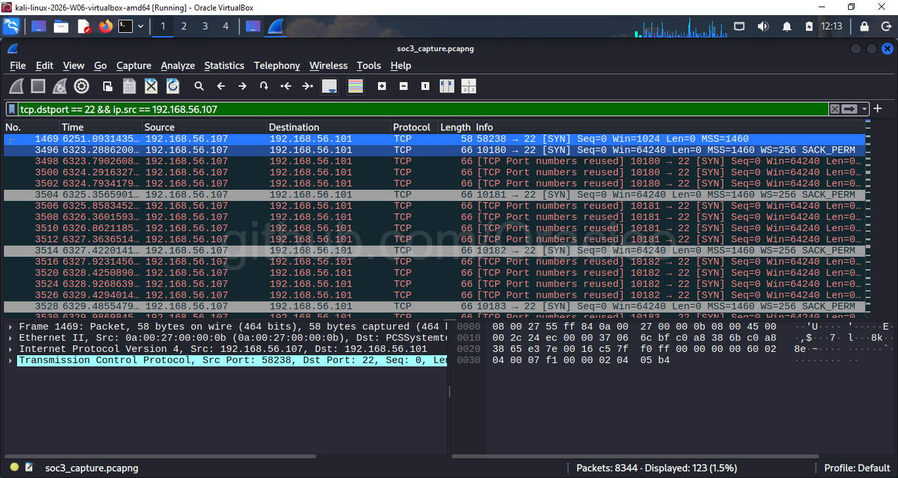

---

### Protocol Hierarchy Statistics

**TCP: 75% (6,260 packets)** — dominated by Nmap SYN flood
**ICMP: 0.8% (68 packets)** — ping sweep clearly visible
**UDP/DHCP/ARP: remaining** — normal background traffic

The TCP dominance in an otherwise quiet lab network is itself an anomaly indicator. In a real SOC, this ratio would trigger investigation.

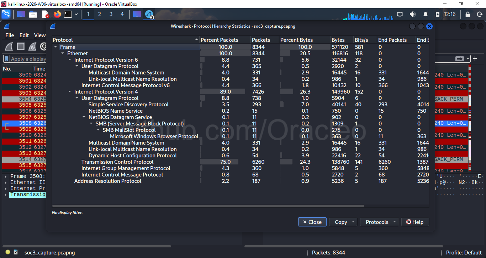

---

### TCP Conversations Analysis

**3,130 TCP conversations** — all between `192.168.56.107` and `192.168.56.101`

All conversations show only **1 packet A→B, 1 packet B→A** — confirming SYN → RST/ACK exchanges (no full handshake). Every stream ID is unique and incremental. This pattern is definitively a port scanner, not a human user.

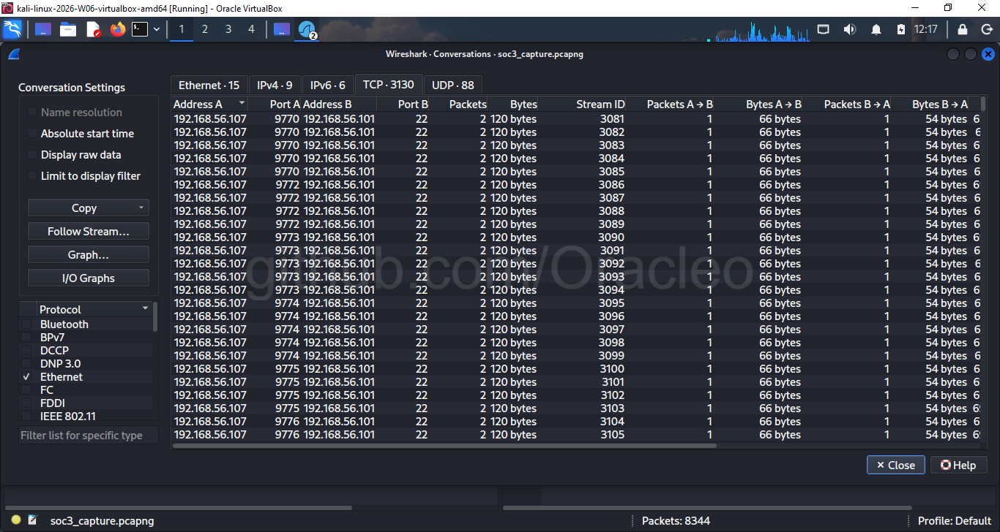

---

## 10. SOC Incident Report

```
╔══════════════════════════════════════════════════════════════╗
║              SOC INCIDENT REPORT — INC-2026-001              ║
╚══════════════════════════════════════════════════════════════╝

Date/Time:      2026-02-25, 11:18 – 11:35 UTC-5
Analyst:        [Your Name]
Severity:       HIGH
Status:         True Positive — Confirmed Attack Sequence
Sensor:         Suricata 8.0.3 on eth0 (192.168.56.101)

━━━━━━━━━━━━━━━━━━━━━━━━━━━━━━━━━━━━━━━━━━━━━━━━━━━━━━━━━━━━
EXECUTIVE SUMMARY
━━━━━━━━━━━━━━━━━━━━━━━━━━━━━━━━━━━━━━━━━━━━━━━━━━━━━━━━━━━━
A single external host (192.168.56.107) conducted a structured,
multi-stage reconnaissance and intrusion attempt against the internal
host 192.168.56.101 between 11:18 and 11:35 on 2026-02-25.

The attack followed the classic kill chain sequence:
  ICMP Recon → Port Scan → Service Brute Force

All activity was detected by Suricata custom rules and confirmed
via Wireshark packet-level forensics.

━━━━━━━━━━━━━━━━━━━━━━━━━━━━━━━━━━━━━━━━━━━━━━━━━━━━━━━━━━━━
ATTACK TIMELINE
━━━━━━━━━━━━━━━━━━━━━━━━━━━━━━━━━━━━━━━━━━━━━━━━━━━━━━━━━━━━

11:18:49  ICMP Ping Sweep begins
          SID 9000001 fired — 20 ICMP Echo Requests
          Attacker confirmed target host is alive

11:22:51  Nmap SYN Scan begins
          SID 9000002 fired — 156 alerts over 1.69 seconds
          SID 9000005 co-fired — 30 DoS pattern alerts
          Attacker scanned ports 1–1000 via stealth SYN method
          3,130 SYN packets captured in Wireshark

11:34:38  SSH Brute Force begins
          SID 9000003 fired — 9 attempts over ~90 seconds
          Attacker attempted repeated SSH connections to port 22
          Source ports incrementing: 9770, 9772, 9773...
          Pattern consistent with automated credential tool

━━━━━━━━━━━━━━━━━━━━━━━━━━━━━━━━━━━━━━━━━━━━━━━━━━━━━━━━━━━━
ATTACKER PROFILE
━━━━━━━━━━━━━━━━━━━━━━━━━━━━━━━━━━━━━━━━━━━━━━━━━━━━━━━━━━━━
Source IP:      192.168.56.107
OS Fingerprint: Windows (TTL=128 in ICMP, SACK_PERM in SYN)
Tools Used:     Nmap 7.98 (SYN scan fingerprint confirmed)
                OpenSSH client (SSH brute force pattern)
                curl/7.68.0 (HTTP scanner user-agent)

━━━━━━━━━━━━━━━━━━━━━━━━━━━━━━━━━━━━━━━━━━━━━━━━━━━━━━━━━━━━
PACKET EVIDENCE SUMMARY
━━━━━━━━━━━━━━━━━━━━━━━━━━━━━━━━━━━━━━━━━━━━━━━━━━━━━━━━━━━━
pcap file:          soc3_capture.pcapng
Total packets:      8,344
ICMP packets:       34 (ping sweep confirmed)
SYN-only packets:   3,130 (port scan confirmed)
Port 22 packets:    123 (brute force confirmed)
TCP conversations:  3,130 unique (all incomplete — no handshake)

━━━━━━━━━━━━━━━━━━━━━━━━━━━━━━━━━━━━━━━━━━━━━━━━━━━━━━━━━━━━
RECOMMENDED RESPONSE ACTIONS
━━━━━━━━━━━━━━━━━━━━━━━━━━━━━━━━━━━━━━━━━━━━━━━━━━━━━━━━━━━━
1. Block 192.168.56.107 at the perimeter firewall immediately
2. Review all auth logs on 192.168.56.101 for successful SSH logins
3. Check 192.168.56.101 for any new user accounts or cron jobs
4. Run integrity check on sensitive files (AIDE or Tripwire)
5. Escalate to SOC L2 for threat hunting across the subnet
6. Add 192.168.56.107 to threat intelligence watchlist

━━━━━━━━━━━━━━━━━━━━━━━━━━━━━━━━━━━━━━━━━━━━━━━━━━━━━━━━━━━━
ANALYST NOTES
━━━━━━━━━━━━━━━━━━━━━━━━━━━━━━━━━━━━━━━━━━━━━━━━━━━━━━━━━━━━
- Rule 9000004 (HTTP User-Agent) did not fire because no web
  server is running on port 80. The curl connection was refused
  at the TCP layer before Suricata could inspect HTTP headers.
  Rule is correctly written — environment limitation only.

- ET SID 2022973 fired repeatedly — Kali Linux hostname detected
  in DHCP broadcasts. In a real network, this would indicate an
  unauthorized Kali machine on the corporate LAN — a Priority 1
  finding that would trigger immediate investigation.

- The Nmap Win=1024 fingerprint in Wireshark is a reliable
  Nmap SYN scan indicator. Real user traffic uses Win=65535
  or OS-scaled values. Win=1024 = scanner.
```

---

## 11. Repository Contents

```
SOC3-Suricata-Wireshark/
│
├── README.md                          ← This document
│
├── rules/
│   └── local.rules                    ← 5 custom Suricata detection rules
│
├── logs/
│   ├── fast.log                       ← Suricata human-readable alert log
│   └── eve.json                       ← Suricata structured JSON alert log
│
├── pcap/
│   └── soc3_capture.pcapng            ← Full Wireshark packet capture
│
└── screenshots/
    ├── 01_suricata_version_verified.png
    ├── 02_suricata_yaml_homenet_afpacket.png
    ├── 03_suricata_rules_updated.png
    ├── 04_suricata_config_test_passed.png
    ├── 05_custom_rules_created_validated.png
    ├── 06_suricata_running_live.png
    ├── 07_wireshark_capturing_eth0.png
    ├── 08_attack_traffic_generated_windows.png
    ├── 09_suricata_fast_log_alerts.png
    ├── 10_suricata_eve_json_alerts.png
    ├── 11_wireshark_save_capture.png
    ├── 12_wireshark_filter_icmp_ping.png
    ├── 13_wireshark_filter_nmap_syn_scan.png
    ├── 14_wireshark_filter_ssh_bruteforce.png
    ├── 15_wireshark_protocol_hierarchy.png
    └── 16_wireshark_conversations_tcp.png
```

---

## 12. Key Takeaways

**What this project demonstrates:**

1. **IDS Deployment** — Suricata configured from scratch on a live interface with a real ruleset
2. **Rule Engineering** — Custom Suricata rules written with threshold logic targeting real attack TTPs
3. **Attack Simulation** — Real tools (Nmap, SSH client, curl) used to generate authentic traffic
4. **Alert Triage** — All 249 alerts reviewed and classified as true/false positive with justification
5. **Packet Forensics** — Wireshark filters used to pivot from IDS alert → raw packet evidence
6. **Incident Documentation** — Full SOC-style incident report written from evidence

**Skills demonstrated:** Suricata, Wireshark, network forensics, IDS rule writing, alert triage, incident reporting, Linux command line, TCP/IP protocol analysis

---

*Project built as part of SOC L1 portfolio — M.Tech Information Security*
*Lab Date: February 25, 2026*
